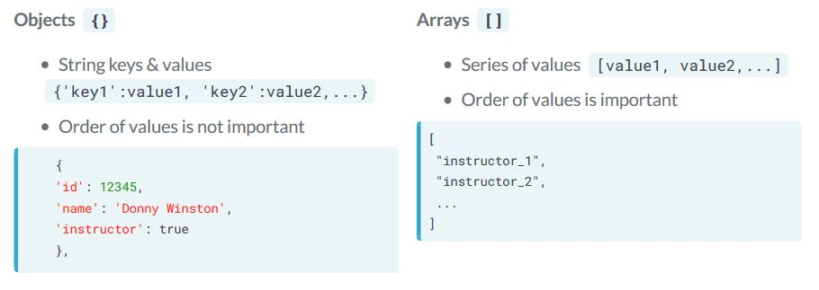
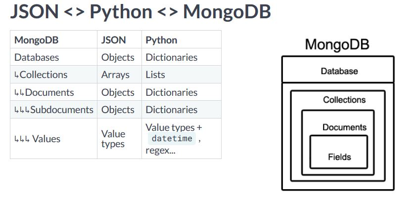
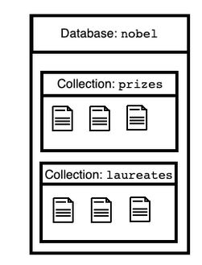

# Introduction to MongoDB in Python
MongoDB is a tool to explore data structured as you see fit. As a NoSQL database, it doesn't follow the strict relational format imposed by SQL. By providing capabilities that typically require adding layers to SQL, it collapses complexity. With dynamic schema, you can handle vastly different data together and consolidate analytics. The flexibility of MongoDB empowers you to keep improving and fix issues as your requirements evolve.

- MongoDB is a tool that helps us explore data without requiring it to have a strict known structure.Because of this we can **handle diverse data together and unify analytics**
- Most API on the web exposes certain data format, if we can expose our data in this format then we can get started with MongoDB.
- JavaScript Object Notation (JSON) - JavaScript is the language of web browsers. JSON is the common way by which web services and client code can pass data.
- **JSON is also the basis of MongoDB data format**
- JSON has two collection structures **Objects {}** and **Arrays []**.
- **Objects {}** maps string **keys to values** and **Arrays [] order values**

<p align="center">
  
</p>

- **Values** : can be **strings** `'name':'Donny Winston`, **numbers** `'id':12345`, `true / false`, `null` or **Another array** `'tags':['Python', MongoDB']` or **Another Object** `[{'id' : 12345, ....},....]`

### JSON <> Python
- These JSON datatypes has equivalance in python.
- **JSON Objects** are like **Python dictionaries** with string type **keys**
- **Arrays** are like **Python list** 
- **Values** mentioned also maps to **Python**, e.g **null in JSON** maps to **None in Python**

### JSON  <> Python <> MongoDB
- How are JSON Python types expressed in MongoDB
- A database maps **names to collections**, we can access collections by names in the same way we access values in the dictionary
- A *collection* inturn is the **list of dictionaries** called **documents by MongoDB**
- When a *dictionary is a value within a document* that's a **subdocuments**
- **Values in the documents** can be any of the types mentioned. MongoDB also supports two types native to python but not JSON. e.g **datetime and regex**
<p align="center">
  
</p>

### The Noble Prize API  data(base)
- Let's see how JSON maps to Python and inturn to MongoDB
<p align="center">
  
</p>

```python
import requests # gets the data from the API
from pymongo import MongoClient  # pymongo is the official python driver for MongoDB

# Client connects to "localhost" by default
client = MongoClient()

# create local "nobel" database on the fly
db = client["nobel"]

for collection_name in ['prizes', 'laureates']:
    # collect the data from the API
    response = requests.get("http://api.nobelprize.org/v1/{}.json".format(collection_name[:-1]))
    # convert the data to json
    documents = response.json()[collection_name]
    # create collections on the fly
    db[collection_name].insert_many(documents)
```

### Accessing databases and collections
- Count documents in the collection and how to find one to inspect
- Note on accessing database and collection from client object : One way is **square bracket notation `[]`**
- If client is the dictionary of databases with database names as keys. A **database inturn is the dictionary of collections with collection names as keys** 
```python
# client is a dictionary of databases
db = client["nobel"]

# database is a dictionary of collections
prizes_collection = db['prizes']
```

- Another way to access database and collection from client object : **dot notation `.`**
- Databases are attributes of a client and collections are attributes of databases
```python
# databases are attributes of a client
db = client.nobel

# collections are attributes of databases
prizes_collection = db['prizes']
```

### Count documents in a collection
- To count documents use the `count_documents` collection method.
- Pass `{} document` with filter to limit what we count. In this case we want unfiltered total count, so we pass empty document {} as a filter.
```python
# use empty document {} as a filter
filter = {}

# count documents in a collection
n_prizes = db.prizes.count_documents(filter)
n_laureates = db.laureates.count_documents(filter)
```

- Finally we can fetch a document and infer the schema of raw JSON data given by the nobel prize API

```python
# find document to inspect
doc = db.prizes.find_one(filter)
```

### Listing databases and collections
- Our **`MongoClient()`** object is not actually a dictionary, so we can't call **`keys()`** to list the names of accessible databases.The same is true for listing collections of a database.
- Instead, we can list database names by calling **`.list_database_names()`** on a client instance, and we can list collection names by calling **`.list_collection_names()`** on a database instance.

#### save a list of names of the databases managed b client
```python
db_names = client.list_database_names()
print(db_names)
```

#### save a list of names of the collections managed by the 'nobel' database
```python
nobel_coll_names = client['nobel'].list_collection_names()
print(nobel_coll_names)
```

### Query a collection to find documents of interest
To find document satisfying some criteria we express the criteria as a document.

### Filters as (sub)documents
Count documents by providing a filter document to match

```python
filter_doc = {
'born' : '1845-03-27',
'diedCountry' : 'Germany',
'gender' : 'male',
'surname' : 'Rontgen'
}

db.laureates.count_documents(filter_doc)
```

#### Simple filters

```python
db.laureates.count_documents({'gender':'female'})
```

There are 48 laureates documents with gender equal to female. We can do the same for other feilds, like:
- country of death

```python
db.laureates.count_documents({'diedCountry' : 'France'})
```

- city of birth

```python
db.laureates.count_documents({'bornCity' : 'Warsaw'})
```

#### Composing filters
Also we can merge criterias in a single filter document.This filter document will have the same form as matching documents.

```python
filter_doc = {'gender':'female',
	      'diedCountry':'France',
	      'bornCity':'Warsaw'}

db.laureates.count_documents(filter_doc)

db.laureates.find_one(filter_doc)
```

### Query operators
We have seen filters that match exact values in the document. What about satisying other constraints?
- Query operators are like different ways to input values on the website form, some values are selected using options, some are selected using range slider.Query operators in MongoDB works the same way.
- We place a **`operator`** in a filter document to wrap around the feild and its exceptable values.

**Query Syntax**
```python
{
# match a single value exactly
	'field_name1':value1,
# use operators
	'field_name2':{
	$operator1:value1,
	$operator2:value2,
	... # more operators
	},
	... # more fields
}
```
- e.g Let's find document where the value diedCountry is either France or USA.

```python
db.laureates.count_documents({
	'diedCountry':{'$in':['France', 'USA']}})
```

- We use the **`$in`** operator to wrap around acceptable values. Operators in MongoDB has a **`$`** sign prefix.
- To find DiedCountry in not equal to certain country we can use the **`$ne`**

```python
db.laureates.count_documents({
	'diedCountry':{'$ne':'France'}})
```

#### Comparison
- > : $gt, >= : $gte
- < : $lt, <= : $lte

```python
db.laureates.count_documents({
	'diedCountry':{'$gt':'Belgium', '$lte':'USA'}})
```

- Strings are compared in lexicographically(alphabetical order).

### Dot Notation : reach into substructure
- To query arrays and sub documents.


